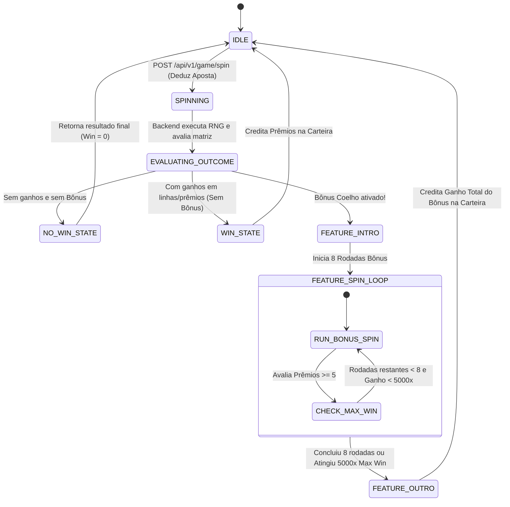

# ESPECIFICAÇÃO COMPLETA DO JOGO: COELHO DA FORTUNA (FORTUNE RABBIT)
> **Manual Técnico e de Regras para Integração e Criação de APIs (Backend, RNG, Estatística e Carteira)**

Este documento contém a especificação completa, matemática, comportamental e estrutural do jogo **Coelho da Fortuna**. Ele foi estruturado especificamente para ser fornecido a uma Inteligência Artificial ou equipe de engenharia encarregada de desenvolver as **APIs de Backend, Motor de RNG, Cálculo Estatístico (RTP), Histórico de Transações e Integração de Carteira**.

---

## 1. VISÃO GERAL E ARQUITETURA DO JOGO

### 1.1. Resumo Executivo
* **Nome do Jogo:** Coelho da Fortuna (Fortune Rabbit)
* **Tipo de Jogo:** Slot / Caça-Níquel Móvel 3D / 2.5D
* **Configuração de Cilindros (Grid Matrix):** 3 Cilindros com posições asimétricas:
  * **Cilindro 1 (Esquerda):** 3 posições (Linhas 0, 1, 2)
  * **Cilindro 2 (Centro):** 4 posições (Linhas 0, 1, 2, 3)
  * **Cilindro 3 (Direita):** 3 posições (Linhas 0, 1, 2)
  * **Total de Células na Matriz:** 10 posições no tabuleiro `[3, 4, 3]`.
* **Linhas de Aposta:** 10 Linhas Fixas.
* **RTP Teórico Alvo:** `96,75%`.
* **Multiplicador de Ganho Máximo:** `5.000×` o valor da aposta total da rodada.
* **Moeda Suportada:** BRL (`R$`) ou unidades genéricas de crédito.

---

## 2. SISTEMA DE APOSTAS E CÁLCULO DE VALORES

### 2.1. Fórmula da Aposta Total
A aposta em cada giro é calculada multiplicando o **Valor da Aposta Base**, o **Nível de Aposta** e o número fixo de **10 Linhas de Aposta**:

$$\text{Aposta Total} = \text{Valor da Aposta} \times \text{Nível de Aposta} \times 10$$

$$\text{Aposta por Linha (Line Stake)} = \text{Valor da Aposta} \times \text{Nível de Aposta}$$

### 2.2. Parâmetros de Entrada da Aposta
| Parâmetro | Mínimo | Máximo | Descrição |
|---|---|---|---|
| **Valor da Aposta (Bet Value)** | R$ 0,05 | R$ 4,00 | Valor monetário atribuído a 1 linha |
| **Nível de Aposta (Bet Level)** | 1 | 10 | Multiplicador de escala da aposta |
| **Linhas Fixas** | 10 | 10 | Quantidade de linhas ativas (fixas) |

#### Exemplo Prático:
* Valor da Aposta = `R$ 0,05`
* Nível de Aposta = `4`
* Linhas = `10`
* **Aposta por Linha** = $0,05 \times 4 = \text{R\$ } 0,20$
* **Aposta Total da Rodada** = $0,20 \times 10 = \text{R\$ } 2,00$

---

## 3. INVENTÁRIO DE SÍMBOLOS E TABELA DE PAGAMENTOS (BASE MULTIPLICADORA x1)

O jogo possui **8 símbolos no total** (7 símbolos regulares/wild e 1 símbolo especial de Prêmio).

### 3.1. Tabela de Símbolos Regulares (Combinações de 3 na Linha)

As combinações pagam exclusivamente quando 3 símbolos idênticos (ou substituídos por Wild) alinham-se em uma das 10 linhas de aposta fixas, da esquerda para a direita.

Para facilitar a lógica da API, a tabela abaixo apresenta os multiplicadores normalizados para **Aposta por Linha (x1)** e para a **Aposta Total (x1)**:

| ID do Símbolo | Nome do Símbolo | Tipo | Multiplicador por Aposta por Linha ($\text{Linha} \times N$) | Multiplicador por Aposta Total ($\text{Total} \times N$) | Descrição e Comportamento |
|---|---|---|:---:|:---:|---|
| `wild` | **WILD** | Especial | **200×** | **20×** | Substitui todos os símbolos comuns. Não substitui o símbolo `prize`. |
| `rabbit` | **Coelho na Barra Dourada** | Pagamento Alto | **100×** | **10×** | Símbolo regular de maior valor. |
| `bag` | **Bolsa da Fortuna** | Pagamento Médio-Alto | **50×** | **5×** | Símbolo temático vermelho de fortuna. |
| `cards` | **Cartas Vermelhas / Coelho Dourado** | Pagamento Médio | **10×** | **1×** | Símbolo médio de cartas/envelopes. |
| `coins` | **Moedas de Ouro** | Pagamento Baixo-Médio | **5×** | **0.5×** | Símbolo de moedas tradicionais. |
| `rockets` | **Lanternas / Fogos** | Pagamento Baixo | **3×** | **0.3×** | Símbolo festivo de lanterna/fogo. |
| `carrot` | **Cenoura** | Pagamento Mínimo | **2×** | **0.2×** | Símbolo de menor pagamento do jogo. |

#### Fórmula de Ganho da Linha em Dinheiro:
$$\text{Ganho da Linha} = \text{Multiplicador do Símbolo (Linha)} \times \text{Aposta por Linha}$$
$$\text{Ganho da Linha} = \text{Multiplicador do Símbolo (Linha)} \times (\text{Valor da Aposta} \times \text{Nível de Aposta})$$

---

### 3.2. Símbolo Especial: Símbolo de Prêmio (`prize`)

* **ID no Backend:** `prize`
* **Comportamento:** Não necessita estar em linha de aposta. Pode surgir em qualquer posição da matriz $3 \times 4 \times 3$.
* **Valores Possíveis por Símbolo de Prêmio:** Cada símbolo carrega um multiplicador impresso sobre a Aposta Total.
* **Valores de Multiplicador (`prize_value`):** 
  `[0.5×, 1×, 2×, 3×, 5×, 10×, 15×, 20×, 25×, 50×, 100×, 250×, 500×]` (Multiplicados pela **Aposta Total**).
* **Condição de Ativação / Pagamento:**
  * Se aparecerem **5 ou mais símbolos de Prêmio** em qualquer lugar do tabuleiro na mesma rodada (jogo base ou rodada bônus), **TODOS os valores estampados nos símbolos de Prêmio são somados e pagos imediatamente**.
  * Se aparecerem de 1 a 4 símbolos de Prêmio, eles permanecem inativos e não pagam prêmio acumulado.
  * O símbolo **WILD** não substitui o símbolo de **Prêmio**.

---

## 4. MAPA DAS LINHAS DE APOSTA (PAYLINES)

A matriz possui 10 posições indexadas por coordenada `[Cilindro (0..2), Linha (0..3)]`:
* **Cilindro 0:** linhas 0, 1, 2
* **Cilindro 1:** linhas 0, 1, 2, 3
* **Cilindro 2:** linhas 0, 1, 2

### Matriz de Coordenadas das 10 Linhas Fixas:
```text
Cilindro 0 (Reel 1)    Cilindro 1 (Reel 2)    Cilindro 2 (Reel 3)
   [0,0]                  [1,0]                  [2,0]
   [0,1]                  [1,1]                  [2,1]
   [0,2]                  [1,2]                  [2,2]
                          [1,3]
```

| N° da Linha | Posição no Cilindro 1 | Posição no Cilindro 2 | Posição no Cilindro 3 | Vetor de Coordenadas `[r1, r2, r3]` |
|:---:|:---:|:---:|:---:|:---:|
| **01** | Linha 0 (Topo) | Linha 0 (Topo) | Linha 0 (Topo) | `[0, 0, 0]` |
| **02** | Linha 0 (Topo) | Linha 1 | Linha 0 (Topo) | `[0, 1, 0]` |
| **03** | Linha 0 (Topo) | Linha 1 | Linha 1 (Meio) | `[0, 1, 1]` |
| **04** | Linha 1 (Meio) | Linha 1 | Linha 0 (Topo) | `[1, 1, 0]` |
| **05** | Linha 1 (Meio) | Linha 1 | Linha 1 (Meio) | `[1, 1, 1]` |
| **06** | Linha 1 (Meio) | Linha 2 | Linha 1 (Meio) | `[1, 2, 1]` |
| **07** | Linha 1 (Meio) | Linha 2 | Linha 2 (Base) | `[1, 2, 2]` |
| **08** | Linha 2 (Base) | Linha 2 | Linha 1 (Meio) | `[2, 2, 1]` |
| **09** | Linha 2 (Base) | Linha 2 | Linha 2 (Base) | `[2, 2, 2]` |
| **10** | Linha 2 (Base) | Linha 3 (Fundo) | Linha 2 (Base) | `[2, 3, 2]` |

---

## 5. JOGOS BÔNUS E RECURSOS ESPECIAIS

### 5.1. Funcionalidade Coelho da Fortuna (Fortune Rabbit Feature)
* **Gatilho de Ativação:** Pode ser ativado aleatoriamente no backend durante qualquer rodada do jogo base.
* **Premiação:** Concede **8 Rodadas da Fortuna Grátis (8 Fortune Spins)**.
* **Comportamento Durante o Bônus:**
  * Durante as 8 rodadas bônus, os cilindros giram contendo **APENAS símbolos de Prêmio** e posições vazias (`blank`).
  * Em cada uma das 8 rodadas bônus, se surgirem 5 ou mais símbolos de Prêmio na tela, a soma de seus valores é concedida imediatamente.
  * O saldo ganho em cada uma das 8 rodadas acumula no placar total do bônus.
  * O valor da aposta utilizado nas rodadas bônus é estritamente idêntico ao da rodada que ativou a funcionalidade.

---

### 5.2. Regra do Ganho Máximo (Max Win Cap)
* **Limite Superior:** **5.000× Aposta Total**.
* **Comportamento da API:** Se durante o jogo base ou no decorrer das rodadas bônus o acúmulo de ganhos atingir ou ultrapassar `5.000×` o valor da aposta total daquela rodada, a rodada/bônus é encerrada imediatamente, o ganho é ajustado exatamente para `5.000× Aposta Total` e o saldo retornado ao jogador é limitado a este valor.

---

## 6. MÁQUINA DE ESTADOS DO JOGO (GAME STATE MACHINE)

A API do servidor deve gerenciar o estado da sessão do jogador seguindo o fluxo de estados abaixo:



---

## 7. ESPECIFICAÇÃO DAS APIS PARA DESENVOLVIMENTO BACKEND

Para conectar o jogo cliente e fornecer dados estatísticos, o backend deve expor as seguintes rotas JSON / RESTful:

### 7.1. Endpoint 1: Inicialização da Sessão (`POST /api/v1/game/init`)
Retorna as configurações do jogo, limites de aposta, saldo atual do jogador e estado pendente (se o jogador caiu durante um bônus).

#### Response Payload (`200 OK`):
```json
{
  "success": true,
  "data": {
    "player": {
      "id": "usr_998123",
      "balance": 150.50,
      "currency": "BRL"
    },
    "gameConfig": {
      "gameId": "fortune-rabbit",
      "minBetValue": 0.05,
      "maxBetValue": 4.00,
      "betLevels": [1, 2, 3, 4, 5, 6, 7, 8, 9, 10],
      "paylinesCount": 10,
      "maxMultiplier": 5000
    },
    "recoveredState": null
  }
}
```

---

### 7.2. Endpoint 2: Giro / Realizar Aposta (`POST /api/v1/game/spin`)
Processa o giro do jogo base e gera o resultado completo (incluindo as rodadas bônus caso o bônus seja engatilhado).

#### Request Payload:
```json
{
  "betValue": 0.05,
  "betLevel": 4
}
```

#### Response Payload (`200 OK`):
```json
{
  "success": true,
  "transactionId": "tx_20260720_0019283",
  "timestamp": "2026-07-20T16:16:00-03:00",
  "betDetails": {
    "betValue": 0.05,
    "betLevel": 4,
    "lines": 10,
    "lineStake": 0.20,
    "totalBet": 2.00
  },
  "balanceBefore": 150.50,
  "balanceAfter": 148.50,
  "result": {
    "grid": [
      [{"type": "rabbit", "prize": 0}, {"type": "wild", "prize": 0}, {"type": "bag", "prize": 0}],
      [{"type": "rabbit", "prize": 0}, {"type": "rabbit", "prize": 0}, {"type": "coins", "prize": 0}, {"type": "cards", "prize": 0}],
      [{"type": "rabbit", "prize": 0}, {"type": "rockets", "prize": 0}, {"type": "carrot", "prize": 0}]
    ],
    "winningLines": [
      {
        "lineIndex": 4,
        "symbol": "rabbit",
        "payoutMultiplier": 100,
        "amount": 20.00,
        "positions": [{"c": 0, "r": 1}, {"c": 1, "r": 1}, {"c": 2, "r": 1}]
      }
    ],
    "prizeSymbolsCount": 0,
    "prizeTotalWin": 0.00,
    "baseGameWin": 20.00,
    "featureTriggered": false,
    "featureResult": null,
    "totalWin": 20.00,
    "reachedMaxWin": false
  },
  "finalBalance": 168.50
}
```

---

### 7.3. Exemplo de Response com Bônus Engatilhado (`featureTriggered: true`)
Quando a rodada engatilha o bônus, o servidor retorna o objeto completo das **8 rodadas bônus** resolvidas para garantir consistência e auditabilidade:

```json
{
  "success": true,
  "transactionId": "tx_20260720_0019300",
  "betDetails": { "totalBet": 2.00 },
  "result": {
    "grid": [ ... ],
    "baseGameWin": 0.00,
    "featureTriggered": true,
    "featureResult": {
      "totalFeatureSpins": 8,
      "spins": [
        {
          "spinIndex": 1,
          "grid": [ ... ],
          "prizeCount": 5,
          "spinWin": 50.00
        },
        {
          "spinIndex": 2,
          "grid": [ ... ],
          "prizeCount": 2,
          "spinWin": 0.00
        }
        // ... até a 8ª rodada
      ],
      "totalFeatureWin": 180.00
    },
    "totalWin": 180.00
  }
}
```

---

### 7.4. Endpoint 3: Histórico de Jogadas (`GET /api/v1/game/history`)
Retorna o histórico com paginação e filtro por data para auditoria de transações.

#### Query Params:
* `page=1&limit=20&filter=today` (Opções: `today`, `7days`, `custom`)

#### Response Payload (`200 OK`):
```json
{
  "success": true,
  "data": {
    "records": [
      {
        "transactionId": "tx_20260720_0019283",
        "timestamp": "2026-07-20T16:16:00-03:00",
        "bet": 2.00,
        "profit": 18.00,
        "totalWin": 20.00,
        "verifyUrl": "https://verify.pgsoft.com/verify?id=tx_20260720_0019283"
      }
    ],
    "summary": {
      "totalBet": 2.00,
      "totalProfit": 18.00,
      "totalRecords": 1
    }
  }
}
```

---

### 7.5. Endpoint 4: API de Estatísticas e Métricas de RTP (`GET /api/v1/admin/stats`)
Permite monitorar a estatística real do servidor versus o RTP teórico do modelo matemático.

#### Response Payload (`200 OK`):
```json
{
  "success": true,
  "stats": {
    "totalSpins": 1000000,
    "totalWagered": 2000000.00,
    "totalWon": 1935000.00,
    "observedRTP": 0.9675,
    "hitFrequency": 0.235,
    "featureTriggerRate": 0.0024,
    "maxWinOccurrences": 2
  }
}
```

---

## 8. REQUISITOS DO MOTOR DE RNG E MODELO MATEMÁTICO DE DADOS

Para a IA backend implementar a geração das rodadas mantendo o **RTP de 96,75%**, recomenda-se a seguinte tabela de pesos para o gerador pseudo-aleatório (PRNG / CS-PRNG):

### 8.1. Probabilidades Base de Distribuição dos Símbolos por Célula
* **Símbolos Regulares (`rabbit`, `bag`, `cards`, `coins`, `rockets`, `carrot`):** ~95,3%
* **Símbolo de Prêmio (`prize`):** ~3,5%
* **Símbolo WILD (`wild`):** ~1,2%
* **Taxa de Disparo do Bônus (Feature Trigger Rate):** ~0,24% das rodadas.

### 8.2. Pesos Frequenciais dos Valores do Símbolo de Prêmio
Quando um símbolo de prêmio é sorteado na matriz, o seu valor multiplicador (aplicado à Aposta Total) deve seguir a distribuição de pesos:

| Multiplicador | Peso Relativo | Probabilidade Aproximada |
|:---:|:---:|:---:|
| **0.5×** | 28.00 | 28,0% |
| **1×** | 22.00 | 22,0% |
| **2×** | 16.00 | 16,0% |
| **3×** | 10.00 | 10,0% |
| **5×** | 8.00 | 8,0% |
| **10×** | 6.00 | 6,0% |
| **15×** | 3.00 | 3,0% |
| **20×** | 2.00 | 2,0% |
| **25×** | 2.00 | 2,0% |
| **50×** | 1.40 | 1,4% |
| **100×** | 0.80 | 0,8% |
| **250×** | 0.35 | 0,35% |
| **500×** | 0.10 | 0,10% |

---

## 9. CHECKLIST PARA ENVIO DA ESPECIFICAÇÃO À IA DE BACKEND

Ao enviar esta especificação para a IA encarregada do backend, oriente-a a:
1. **Criar a camada de RNG independente** que gera a matriz $3 \times 4 \times 3$ com base nos pesos definidos.
2. **Implementar a rotina de avaliação de linhas (`evaluateGrid`)** que verifica as 10 linhas fixas e trata a regra do `WILD` e dos 5+ símbolos de `Prêmio`.
3. **Garantir atomicidade de carteira (Wallet API):** Deduzir o valor da aposta e creditar o ganho na mesma transação de banco de dados.
4. **Respeitar o teto máximo de 5.000× a aposta total**.
5. **Gravar logs auditáveis com fuso horário GMT-3** contendo a Hash/ID da transação para integração com sistemas de verificação de autenticidade (`verify`).

---
*Fim da documentação técnica e de regras do jogo Coelho da Fortuna.*
